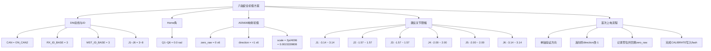

# 六轴烧录前参数与安全初值图

## 图1：烧录前参数表

```mermaid
flowchart TB
  A[六轴烧录前参数表] --> B[板级配置\nboard_def.h]
  A --> C[六轴DM电机\narm.h]
  A --> D[六轴Home角\narm.h]
  A --> E[AS5600映射\nmoving_behavior.cpp]
  A --> F[机构与底盘参数\nrobot_def.h]
  A --> G[操作映射与灵敏度\noperation_def.h]
  A --> H[联调核对项]

  B --> B1[BOARD_TYPE]
  B --> B2[BOARD_NUM]
  B --> B3[BOARD_PLACE]

  C --> C1[ARM_CONTROL_DM_CAN]
  C --> C2[ARM_CONTROL_DM_RX_ID_BASE]
  C --> C3[ARM_CONTROL_DM_MST_ID_BASE]
  C --> C4[J1~J6 ID连续分配]

  D --> D1[ARM_HOME_Q1_RAD]
  D --> D2[ARM_HOME_Q2_RAD]
  D --> D3[ARM_HOME_Q3_RAD]
  D --> D4[ARM_HOME_Q4_RAD]
  D --> D5[ARM_HOME_Q5_RAD]
  D --> D6[ARM_HOME_Q6_RAD]

  E --> E1[zero_raw x6]
  E --> E2[direction x6]
  E --> E3[scale x6]
  E --> E4[q_min/q_max x6]

  F --> F1[YAW_OFFSET / PIT_OFFSET]
  F --> F2[WHEEL_BASE / TRACK_WIDTH]
  F --> F3[RADIUS_WHEEL / REDUCTION_RATIO_WHEEL]

  G --> G1[通道映射]
  G --> G2[鼠标灵敏度]
  G --> G3[遥控器灵敏度]

  H --> H1[上位机12字节顺序: J1->J6]
  H --> H2[CAN ID无冲突]
  H --> H3[首次校准并写入flash]
```

## 图2：安全初值方案

## 图3：横向表格海报版（烧录前检查）

| 分组 | 参数项 | 建议值/填写值 | 备注 |
|---|---|---|---|
| 板级 | `BOARD_TYPE` | `DJI_CBOARD` | C板/A板二选一 |
| 板级 | `BOARD_NUM` | `ONE_BOARD` | 单板/双板 |
| 板级 | `BOARD_PLACE` | `ON_CHASSIS` | 底盘板/云台板 |
| 六轴DM | `ARM_CONTROL_DM_CAN` | `ON_CAN2` | 与实物接线一致 |
| 六轴DM | `ARM_CONTROL_DM_RX_ID_BASE` | `3` | J1~J6 连续 +1 |
| 六轴DM | `ARM_CONTROL_DM_MST_ID_BASE` | `3` | J1~J6 连续 +1 |
| Home角 | `ARM_HOME_Q1_RAD` | `0.0` | 建议按实物填写 |
| Home角 | `ARM_HOME_Q2_RAD` | `0.0` | 建议按实物填写 |
| Home角 | `ARM_HOME_Q3_RAD` | `0.0` | 建议按实物填写 |
| Home角 | `ARM_HOME_Q4_RAD` | `0.0` | 建议按实物填写 |
| Home角 | `ARM_HOME_Q5_RAD` | `0.0` | 建议按实物填写 |
| Home角 | `ARM_HOME_Q6_RAD` | `0.0` | 建议按实物填写 |
| 机构参数 | `YAW_OFFSET / PIT_OFFSET` | `5400 / 7200` | 云台零位 |
| 机构参数 | `WHEEL_BASE / TRACK_WIDTH` | `350 / 300` | 机械尺寸(mm) |
| 机构参数 | `RADIUS_WHEEL` | `60` | 轮半径(mm) |
| 机构参数 | `REDUCTION_RATIO_WHEEL` | `19.0` | 传动比 |
| 操作映射 | `YAW_CHANNEL / PITCH_CHANNEL` | `2 / 3` | 遥控器通道 |
| 操作映射 | `CHASSIS_X_CHANNEL / CHASSIS_Y_CHANNEL` | `1 / 0` | 遥控器通道 |
| 协议核对 | 主控载荷长度 | `12 bytes` | 6轴*2字节 |
| 协议核对 | 上位机轴顺序 | `J1->J2->J3->J4->J5->J6` | 固定顺序 |

## 图4：横向表格海报版（六轴安全初值）

| 轴号 | `rx_id` | `mst_id` | `zero_raw` | `direction` | `scale(rad/count)` | `q_min(rad)` | `q_max(rad)` |
|---|---:|---:|---:|---:|---:|---:|---:|
| J1 | 3 | 3 | 0 | +1 | 0.0015339808 | -3.14 | 3.14 |
| J2 | 4 | 4 | 0 | +1 | 0.0015339808 | -1.57 | 1.57 |
| J3 | 5 | 5 | 0 | +1 | 0.0015339808 | -1.57 | 1.57 |
| J4 | 6 | 6 | 0 | +1 | 0.0015339808 | -2.00 | 2.00 |
| J5 | 7 | 7 | 0 | +1 | 0.0015339808 | -2.00 | 2.00 |
| J6 | 8 | 8 | 0 | +1 | 0.0015339808 | -3.14 | 3.14 |

### 快速调参步骤

1. 单轴联调，确认方向是否正确。
2. 方向反向则该轴 `direction = -1`。
3. 记录机械零位原始值，回填该轴 `zero_raw`。
4. 六轴都确认后执行 `CALIBRATE`，写入 `zero_offset` 到 flash。
